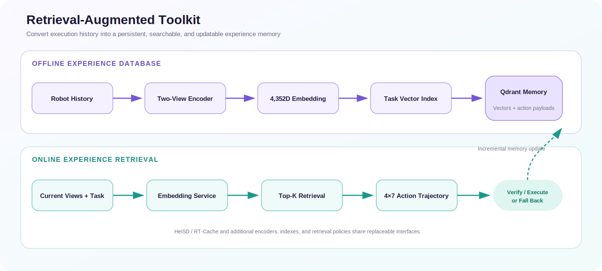

<div align="center">

# RoboNix 检索增强 Toolkit

**面向具身智能体的 HeiSD / RT-Cache 经验记忆服务**

[English](README.md) · [快速开始](#快速开始) · [数据与模型](#数据集模型与数据库来源) · [构建数据库](#构建检索数据库) · [在线检索](#启动在线服务) · [路线图](TODO.md)


</div>

RoboNix 检索增强 Toolkit 将 HeiSD / RT-Cache 整理为可以独立部署的经验记忆
服务。系统把历史机器人执行数据编码为多模态向量，将向量和动作轨迹载荷写入
Qdrant（向量数据库），再根据当前场景和语言指令检索相似经验，返回候选动作轨迹
供安全验证、执行或策略回退。

## 架构



已验证的双视角 Mix 路径只依赖 Qdrant，不要求 MongoDB。MongoDB 仅保留给早期
数据采集流程。第三视角和腕部视角分别提取 DINOv2 与 SigLIP 特征，最终形成
4352 维场景向量。

| 特征 | 维度 |
| --- | ---: |
| 第三视角 DINOv2 | 1024 |
| 第三视角 SigLIP | 1152 |
| 腕部视角 DINOv2 | 1024 |
| 腕部视角 SigLIP | 1152 |
| **Mix 向量** | **4352** |

## 已验证版本

| 验证项 | 结果 |
| --- | --- |
| 包结构与独立目录命令 | 5 项测试通过 |
| 编码服务 | OpenVLA 成功加载，健康检查正常 |
| Qdrant 数据结构 | 39 个集合，4352 维余弦向量，载荷字段严格检查通过 |
| 数据规模 | 273,465 条经验 |
| 端到端请求 | 两张图像和指令成功返回 4×7 动作轨迹 |

## 快速开始

```bash
conda create -n robonix-retrieval python=3.10 -y
conda activate robonix-retrieval
python -m pip install --upgrade pip
python -m pip install -e .

python -m pytest -q tests
python -m scripts.run --help
```

## 数据集、模型与数据库来源

| 资产 | 来源 | 推荐位置 |
| --- | --- | --- |
| 基础 OpenVLA | Hugging Face 上的 `openvla/openvla-7b` | `$HF_HOME/hub` 或本地模型目录 |
| 修改版 LIBERO RLDS | `openvla/modified_libero_rlds` | `$DATA_ROOT/datasets/libero_rlds` |
| 固定数据版本 | `6ce6aaaaabdbe590b1eef5cd29c0d33f14a08551` | 下载脚本自动固定 |
| Qdrant 数据库 | 使用本仓库脚本从 RLDS 数据构建 | `$DATA_ROOT/databases/rtcache_mix_qdrant` |

下载约 10GB 的修改版 LIBERO RLDS：

```bash
export DATA_ROOT=/data/robonix-retrieval
DOWNLOAD_FULL_DATASET=1 \
  scripts/data/download_libero_rlds.sh "$DATA_ROOT/datasets/libero_rlds"
```

仓库不包含模型权重、数据集、已构建数据库或输出。共享服务器已有资产时应使用软
链接，避免重复复制。

## 启动 Qdrant

```bash
docker run -d \
  --name rtcache-qdrant \
  -p 6333:6333 \
  -p 6334:6334 \
  -v "$DATA_ROOT/databases/rtcache_mix_qdrant:/qdrant/storage" \
  qdrant/qdrant:v1.16.2
```

生产环境建议使用支持可靠文件锁的本地文件系统。NFS（网络文件系统）可能触发
一致性警告并显著增加数据库恢复时间。

## 启动编码服务

```bash
python -m scripts.run \
  scripts/embedding/embedding_server_mix.py \
  --host 0.0.0.0 \
  --port 9021 \
  --device cuda:0 \
  --workers 1
```

## 构建检索数据库

数据库的每条经验包含语言指令、当前 7 维动作和后续三个 7 维动作。先用少量
Episode（回合）验证构建流程：

```bash
python -m scripts.run \
  scripts/data_processing/process_libero_goal_mix.py \
  --dataset_type goal \
  --base_dataset_path "$DATA_ROOT/datasets/libero_rlds" \
  --embedding_server_url http://127.0.0.1:9021/predict \
  --qdrant_host 127.0.0.1 \
  --qdrant_port 6333 \
  --batch_size 50 \
  --max_episodes 2
```

`--clear_db` 和 `--clear_all` 会删除已有集合，默认不要使用。小规模构建成功后，
再把 `--max_episodes` 设置为 `-1` 构建完整数据库。

## 启动在线服务

```bash
python -m scripts.run \
  scripts/retrieval/retrieval_libero_goal_mix.py \
  --host 0.0.0.0 \
  --port 5003 \
  --embedding-url http://127.0.0.1:9021/predict \
  --qdrant-host 127.0.0.1 \
  --qdrant-port 6333 \
  --dataset-types goal
```

发送双视角检索请求：

```bash
curl -X POST http://127.0.0.1:5003/pipeline \
  -F "third_person_image=@third_person.png" \
  -F "wrist_image=@wrist.png" \
  -F "instruction=open the top drawer and put the bowl inside" \
  -F "dataset_type=goal"
```

返回动作只能被视为候选。真实机器人执行前必须检查动作维度、关节限制、当前状态、
碰撞约束、数据时效性以及回退条件。

## 目录结构

```text
.
├── modules/                  # 数据库、编码、索引、检索和记忆更新接口
├── scripts/                  # 数据下载、构库、服务与维护入口
├── benchmarks/               # VINN、BehaviorRetrieval 和验证代码
├── configs/                  # 数据库与服务配置
├── requirements/             # 依赖版本
├── tests/                    # 结构与独立入口测试
├── vendor/rtcache/           # 权威 HeiSD / RT-Cache 实现
├── docs/assets/              # 架构图
└── service_bootstrap.py      # 原始代码激活与安全脚本分发
```

## 贡献者

感谢 [HuiruHe](https://github.com/HuiruHe) 和
[zhengzihaoPKU](https://github.com/zhengzihaoPKU) 对本工具包的贡献。贡献者记录
规则见 [CONTRIBUTORS.md](CONTRIBUTORS.md)。

## 引用与协议

引用信息见 `CITATION.cff`。本项目采用木兰宽松许可证第 2 版(Mulan PSL v2)，
详见 [LICENSE](LICENSE)；第三方代码继续遵循各自目录中的原始协议。
