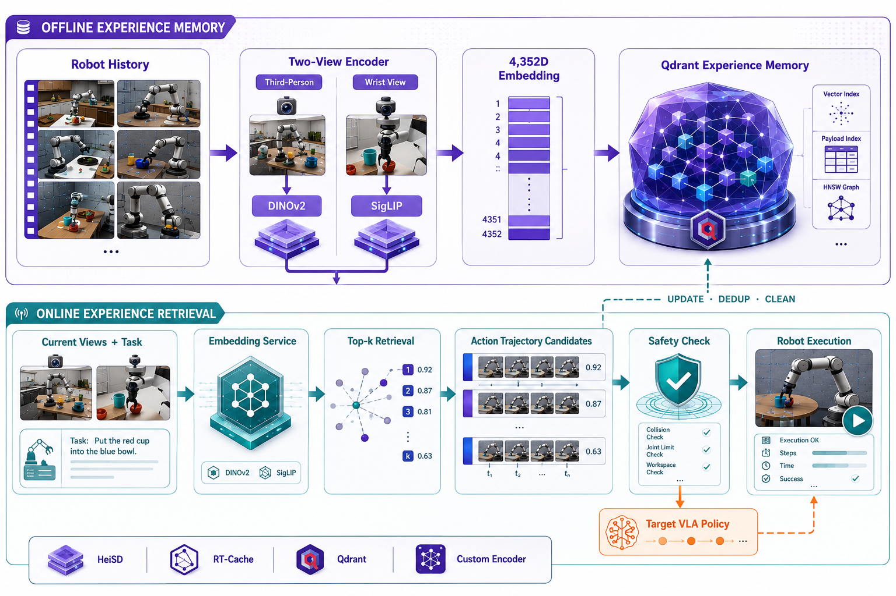
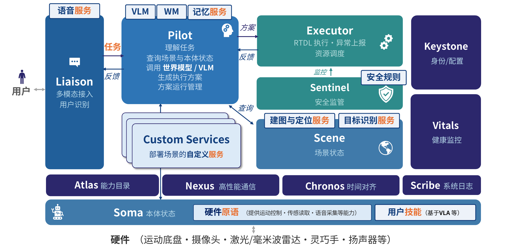

<div align="center">

# RoboNix 经验记忆与复用 Skill

**面向具身模型的系统级经验记忆、检索与动作复用 Skill（技能）**

[English](README.md) · [🚀 快速开始](#quick-start) · [📦 数据与模型](#datasets) · [🗄️ 构建数据库](#build-index) · [📝 引用](#citation)


[](LICENSE)
[](https://github.com/lusunn111/RoboNix-Retrieval-Augmented-Toolkit/stargazers)

</div>

**RoboNix 经验记忆与复用 Skill** 面向现有具身模型，让历史执行经验直接参与当前
决策，而不是只停留在离线数据中。它检索与当前场景和指令匹配的候选动作，并通过
校验与策略回退控制错误检索的影响，从而减少重复推理且不替换原始策略。当前已支持
OpenVLA 和 π0，以及单视角检索、双视角 Mix 检索与动作块级混合校验。

<a id="performance-snapshot"></a>
## 📊 效果概览

经验记忆链路已经在词元式和扩散式 VLA 上完成混合校验执行评测。下表直接展示
任务成功率（SR）以及相对原始模型的端到端加速比。

| 模型 | LIBERO 套件 | 成功率 | 加速比 |
| --- | --- | ---: | ---: |
| OpenVLA | Goal | 73.0% | 2.38× |
| OpenVLA | Object | 71.0% | **2.45×** |
| OpenVLA | Spatial | 78.0% | 1.90× |
| OpenVLA | Long | 47.0% | 1.79× |
| π0 | Goal | 93.33% | 2.97× |
| π0 | Object | **98.33%** | 2.21× |
| π0 | Spatial | 94.67% | 2.47× |
| π0 | Long | 78.33% | **3.01×** |

## 📚 目录

- [📊 效果概览](#performance-snapshot)
- [📰 最新进展](#news)
- [⚡ 系统能力与效果](#system-results)
- [🧠 架构总览](#architecture)
- [🔌 RoboNix 集成与前景](#robonix-integration)
- [🧪 已验证版本](#validated-release)
- [⚙️ 环境要求](#requirements)
- [🚀 快速开始](#quick-start)
- [📦 数据集、模型与数据库来源](#datasets)
- [🗄️ 构建检索数据库](#build-index)
- [🌐 启动在线服务](#retrieval-service)
- [🗺️ 路线图](#roadmap)
- [📝 引用](#citation)
- [🤝 贡献者](#contributors)
- [📄 协议](#license)

<a id="news"></a>
## 📰 最新进展

- **2026-07-19**：🆕 发布系统级经验记忆与复用 Skill，补充能力效果、
  模型支持和中英文文档。
- **2026-07-18**：🔥 从独立仓库根目录完成双视角图像、编码、Qdrant 检索和
  4×7 动作轨迹返回的端到端验证。
- **2026-07-18**：🗄️ 严格检查 39 个 Mix 集合、273,465 条经验以及 4352 维
  余弦向量和动作载荷。

<a id="system-results"></a>
## ⚡ 系统能力与效果

从 RoboNix 运行时视角看，该 Skill 是一个有状态的经验记忆提供方。它把历史观测
和动作转化为可复用记忆，为当前任务检索候选轨迹，并在检索结果与物理执行之间
保留校验和策略回退边界。

| 系统级结果 | 当前能力 |
| --- | --- |
| 经验记忆 | 已索引 **273,465 条**机器人执行经验 |
| 在线检索规模 | **39 个** Qdrant 集合，采用 **4352 维**双视角向量 |
| 已验证服务响应 | 两张图像 + 指令 → **4×7** 候选动作轨迹 |
| 混合具身执行 | OpenVLA 达到 **2× 以上**加速，π0 达到**接近 3×**加速 |

### 支持模型

| 模型系列 | 状态 | 支持范围 |
| --- | --- | --- |
| OpenVLA | ✅ 已完成 | 场景编码、Qdrant 检索、混合候选生成和动作返回 |
| π0 | ✅ 已完成 | 已保留研究实现中的动作块级候选校验链路 |
| π0.5 / π0-FAST | ⏳ 进行中 | 尚未完成公开端到端运行流程 |

<a id="architecture"></a>
## 🧠 架构总览

<!--
IMAGEGEN ASSET
当前图片：docs/assets/retrieval-memory-overview-v2.png
重新生成提示词：docs/assets/IMAGEGEN_PROMPTS.md
原 SVG 继续作为可编辑备用文件保留。
-->

<div align="center">
  
  <p><b>图 1.</b> 离线经验记忆构建，以及带策略回退和持续记忆更新的在线双视角检索链路。</p>
</div>

已验证的双视角 Mix 路径只依赖 Qdrant，不要求 MongoDB。MongoDB 仅保留给早期
数据采集流程。第三视角和腕部视角分别提取 DINOv2 与 SigLIP 特征，最终形成
4352 维场景向量。

| 特征 | 维度 |
| --- | ---: |
| 第三视角 DINOv2 | 1024 |
| 第三视角 SigLIP | 1152 |
| 腕部视角 DINOv2 | 1024 |
| 腕部视角 SigLIP | 1152 |
| **Mix 向量** | **4352** |

<a id="robonix-integration"></a>
## 🔌 RoboNix 集成与前景

该 Skill 是一个可独立部署的 RoboNix 能力提供方，为具身执行维护经验记忆。Scene 提供当前观测与任务上下文，Atlas 发现能力提供方，Nexus 传输多模态引用，Pilot 使用返回的候选轨迹，而不把数据库逻辑写入 RoboNix 核心。

<div align="center">
  
  <p><b>图 2.</b> 可复用记忆服务、自定义服务与基于 VLA 的用户技能在 RoboNix 中的系统级接入位置。</p>
</div>

未来可以进一步形成持续更新的机器人经验记忆，支持可替换编码器、层次化索引、冗余压缩、失效清理和带安全约束的跨任务轨迹复用。

<a id="validated-release"></a>
## 🧪 已验证版本

| 验证项 | 结果 |
| --- | --- |
| 包结构与独立目录命令 | 5 项测试通过 |
| 编码服务 | OpenVLA 成功加载，健康检查正常 |
| Qdrant 数据结构 | 39 个集合，4352 维余弦向量，载荷字段严格检查通过 |
| 数据规模 | 273,465 条经验 |
| 端到端请求 | 两张图像和指令成功返回 4×7 动作轨迹 |

<a id="quick-start"></a>
## 🚀 快速开始

```bash
conda create -n robonix-retrieval python=3.10 -y
conda activate robonix-retrieval
python -m pip install --upgrade pip
python -m pip install -r requirements.txt
python -m pip install -e . --no-deps

python -m pytest -q tests
python -m scripts.run --help
```

<a id="requirements"></a>
## ⚙️ 环境要求

| 组件 | 要求 |
| --- | --- |
| 操作系统 | 推荐 Linux，用于 CUDA、Docker、LIBERO 和机器人部署 |
| Python | 3.10 或更高版本 |
| PyTorch | 2.2.0 |
| 数据库 | 已验证双视角路径使用 Qdrant；MongoDB 仅用于早期兼容流程 |
| 模型 | OpenVLA 检查点；部分编码路径需要 CLIP |
| 仿真环境 | LIBERO 及其任务和数据资产 |

根目录 `requirements.txt` 是统一依赖入口，完整固定版本位于
`requirements/requirements.txt`。Flash Attention 对 CUDA 与编译器版本敏感，
应先安装匹配的 PyTorch，再按 README 英文版中的命令单独构建。

<a id="datasets"></a>
## 📦 数据集、模型与数据库来源

| 资产 | 来源 | 推荐位置 |
| --- | --- | --- |
| 基础 OpenVLA | Hugging Face 上的 `openvla/openvla-7b` | `$HF_HOME/hub` 或本地模型目录 |
| 修改版 LIBERO RLDS | `openvla/modified_libero_rlds` | `$DATA_ROOT/datasets/libero_rlds` |
| 固定数据版本 | `6ce6aaaaabdbe590b1eef5cd29c0d33f14a08551` | 下载脚本自动固定 |
| Qdrant 数据库 | 使用本仓库脚本从 RLDS 数据构建 | `$DATA_ROOT/databases/rtcache_mix_qdrant` |

下载约 10GB 的修改版 LIBERO RLDS：

```bash
export DATA_ROOT=/data/robonix-retrieval
DOWNLOAD_FULL_DATASET=1 \
  scripts/data/download_libero_rlds.sh "$DATA_ROOT/datasets/libero_rlds"
```

仓库不包含模型权重、数据集、已构建数据库或输出。共享服务器已有资产时应使用软
链接，避免重复复制。

## 🗄️ 启动 Qdrant

```bash
docker run -d \
  --name rtcache-qdrant \
  -p 6333:6333 \
  -p 6334:6334 \
  -v "$DATA_ROOT/databases/rtcache_mix_qdrant:/qdrant/storage" \
  qdrant/qdrant:v1.16.2
```

生产环境建议使用支持可靠文件锁的本地文件系统。NFS（网络文件系统）可能触发
一致性警告并显著增加数据库恢复时间。

## 🧠 启动编码服务

```bash
python -m scripts.run \
  scripts/embedding/embedding_server_mix.py \
  --host 0.0.0.0 \
  --port 9021 \
  --device cuda:0 \
  --workers 1
```

<a id="build-index"></a>
## 🗄️ 构建检索数据库

数据库的每条经验包含语言指令、当前 7 维动作和后续三个 7 维动作。先用少量
Episode（回合）验证构建流程：

```bash
python -m scripts.run \
  scripts/data_processing/process_libero_goal_mix.py \
  --dataset_type goal \
  --base_dataset_path "$DATA_ROOT/datasets/libero_rlds" \
  --embedding_server_url http://127.0.0.1:9021/predict \
  --qdrant_host 127.0.0.1 \
  --qdrant_port 6333 \
  --batch_size 50 \
  --max_episodes 2
```

`--clear_db` 和 `--clear_all` 会删除已有集合，默认不要使用。小规模构建成功后，
再把 `--max_episodes` 设置为 `-1` 构建完整数据库。

<a id="retrieval-service"></a>
## 🌐 启动在线服务

```bash
python -m scripts.run \
  scripts/retrieval/retrieval_libero_goal_mix.py \
  --host 0.0.0.0 \
  --port 5003 \
  --embedding-url http://127.0.0.1:9021/predict \
  --qdrant-host 127.0.0.1 \
  --qdrant-port 6333 \
  --dataset-types goal
```

发送双视角检索请求：

```bash
curl -X POST http://127.0.0.1:5003/pipeline \
  -F "third_person_image=@third_person.png" \
  -F "wrist_image=@wrist.png" \
  -F "instruction=open the top drawer and put the bowl inside" \
  -F "dataset_type=goal"
```

返回动作只能被视为候选。真实机器人执行前必须检查动作维度、关节限制、当前状态、
碰撞约束、数据时效性以及回退条件。

## 🗂️ 目录结构

```text
.
├── modules/                  # 数据库、编码、索引、检索和记忆更新接口
├── scripts/                  # 数据下载、构库、服务与维护入口
├── benchmarks/               # VINN、BehaviorRetrieval 和验证代码
├── configs/                  # 数据库与服务配置
├── requirements.txt          # 统一安装入口
├── requirements/             # 依赖固定版本
├── tests/                    # 结构与独立入口测试
├── vendor/rtcache/           # 检索执行与经验记忆兼容实现
├── docs/assets/              # 架构图
└── service_bootstrap.py      # 原始代码激活与安全脚本分发
```

<a id="roadmap"></a>
## 🗺️ 路线图

- [x] 发布可独立运行的纯源码仓库。
- [x] 验证 OpenVLA 编码、Qdrant 检索和 4×7 动作返回链路。
- [x] 保留 π0 动作块级检索与校验研究链路。
- [x] 采用与 RoboNix 一致的木兰宽松许可证并补全引用。
- [ ] 发布小规模双视角示例数据和预构建 Qdrant 索引。
- [ ] 提供容器镜像和带鉴权的生产服务示例。
- [ ] 增加增量记忆去重、压缩和过期清理策略。
- [ ] 完成 π0.5 和 π0-FAST 的公开端到端运行流程。
- [ ] 提供带版本号的 RoboNix 服务适配器。

<a id="citation"></a>
## 📝 引用

如果该 Skill 对你的研究有帮助，欢迎给仓库一个 Star ⭐，并引用本软件仓库：

```bibtex
@software{mao2026robonix_experience_memory_reuse_skill,
  author  = {Mao, Zhihao and He, Huiru and Zheng, Zihao},
  title   = {RoboNix Experience Memory and Reuse Skill},
  year    = {2026},
  version = {0.1.0},
  url     = {https://github.com/lusunn111/RoboNix-Retrieval-Augmented-Toolkit}
}
```

<a id="contributors"></a>
## 🤝 贡献者

感谢 [HuiruHe](https://github.com/HuiruHe) 和
[zhengzihaoPKU](https://github.com/zhengzihaoPKU) 对该 Skill 的贡献。贡献者记录
规则见 [CONTRIBUTORS.md](CONTRIBUTORS.md)。

<a id="license"></a>
## 📄 协议

本项目采用木兰宽松许可证第 2 版(Mulan PSL v2)，详见 [LICENSE](LICENSE)；
第三方代码继续遵循各自目录中的原始协议。
